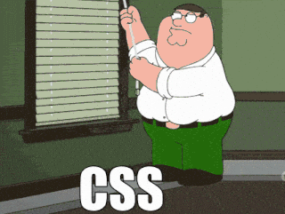
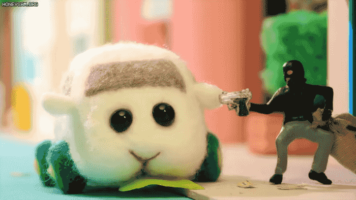

## goorm 풀스택 1회차 PBL과제 B형

### MOGAKO
goorm 풀스택 1회차 7조 
정답이 아닌 방향을 중요시하는 사람들이 모여, 
각자의 학습에 좀 더 몰입할 수 있도록 형성된 스터디  

한규민 | 이재영 | 이정원 | 함채현
| :-: | :-: | :-: | :-: |
 |  |  | 
팀장 | 팀원 | 팀원 | 팀원
Full-stack | Full-stack | iOS | iOS

 

## Stacks
### Environment

             

### Development

### Communication

